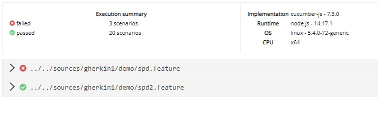

# Запуск тестов
Для запуска существующих тестов потребуется войти в файл с расширением **.featureset**, на третей строке указать путь к запускаемой директории, в нашем случае - это папка **demo** со всеми файлами внутри - **"demo/*"**. Или прописать опредленные для запуска файлы, например так - **"spd.features"**. Как будут указаны нужные параметры для запуска, можно нажать на кнопку **Run**.

Страница с подробным описанием файлов [.featureset](../preparationForWork/featureset.md)

### Пунктиром подчеркнуты описаные выше строки и элементы

# Просмотр лога или репортов

Запустив тесты, можно увидеть в правой части приложения  текущий отчет который будет обновляться при прохождении каждого шага. В самом начале отчета есть ID текущего запуска и текущий отчет можно посмотреть в более читаемом виде по адресу http://am2.advexcel.tech:8099/

Перейдя по вышеуказанному адресу и найдя по дате, времени или имени билда наш отчет,  можно перейти к нему и увидеть несколько папок и файлов:

- error_screenshots - **папка в которой создаются скриншоты в момент падения теста**
- screenshots - **папка в которой хранятся скриншоты сравнений**
- report.html - **человекопонятный отчет о прохождении тестов**
- report.json - **машинный отчет о прохождении тестов**

В этом отчете мы видим  непройденый тест(помеченный красным цветом) и один пройденный(помечен зеленым)

Кликнув по нужной ссылке, можно увидеть детальный отчет успешного прохождения теста, а так-же место где тест упал и по какой причине.

Исходя из лога падения, можно перейти на папку выше в **error_screenshots** и увидеть скриншот сценария в момент которого произошла ошибка. Этот скриншот поможет понять что произошло в момент падения и скорректировать свой тест.