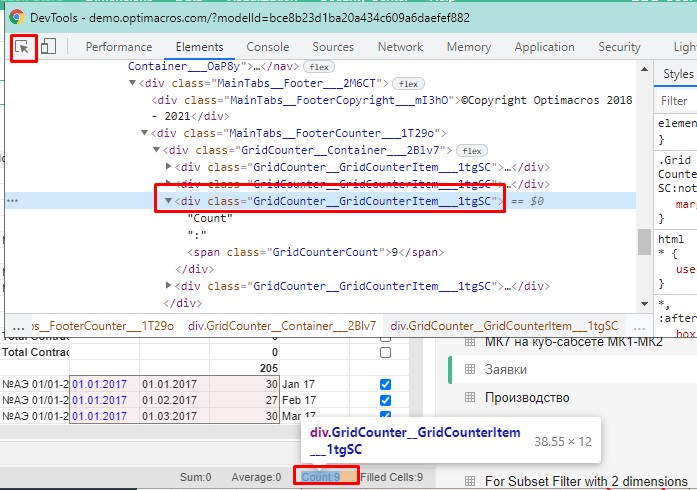

# Селекторы

В этой сборке есть база готовых селекторов, с аргументами и без.
- Аргумент для селектора задается внутри круглых скобок  ```( )```, и обычно это то, что лежит внутри атрибутов селектора:
> When I click on "Tab Header(Main Dashboard)"

Т.е. у нас есть шаг с кликом на элемент `Tab Header` с текстом в круглых скобках `Main Dashboard` - это и есть аргумент в селекторе. Таким образом мы можем обратиться к конкретному элементу на странице приложения.

- Или же можем что-то сделать с селектором без аргумента, например проверить существование:
> And I see that "Modal" exists 

Селектор с названием `Modal` - это элемент на странице с классом ``ReactModal__Content`` и его я нашел на странице [СЕЛЕКТОРЫ](./selector.md)

___
Селектор с аргументом, может указывать на какой-то элемент приложения с каким то текстом, значением и атрибутом.

Селектор без аргумента, это единичный элемент которому не нужен аргумент. Например лоадер.. или блок в котором есть много других элементов у которых уже будет селектор с аргументом.. 

Для поиска нужного селектора нужно в браузере инспектором кода кликнуть на нужный вам элемент, выбрать и скопировать в консоли класс и поискать его в [базе селекторов](./selector.md)



**Далее переходим на страницу -** [СЕЛЕКТОРЫ](./selector.md) и ищем готовое решение.

Может быть, что по первому попавшемуся классу вы не найдете селектор, тогда подставьте ближайшие классы из консоли, если и это не принесет результата, тогда прийдется добавить новый селектор.
Для добавления не существующего селектора вам потребуется ряд [определенных действий]() - **раздел еще не задокументирован!**


[СЕЛЕКТОРЫ](./selector.md)

[Оглавление](../README.md)